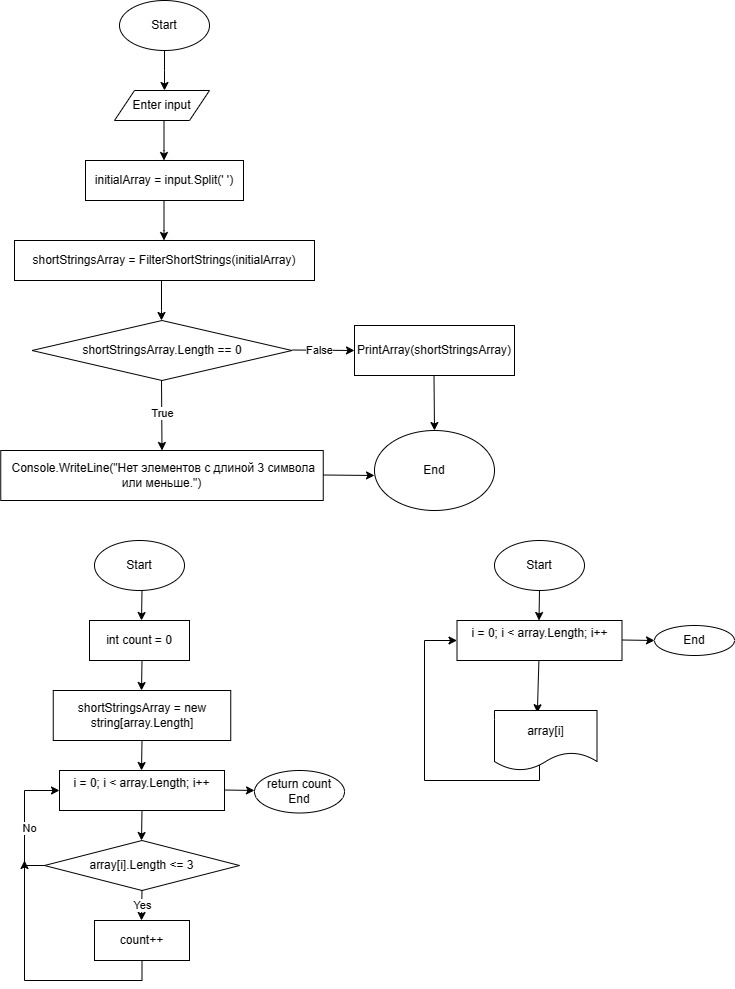
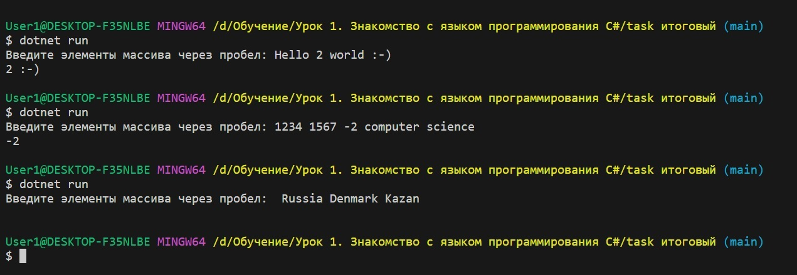
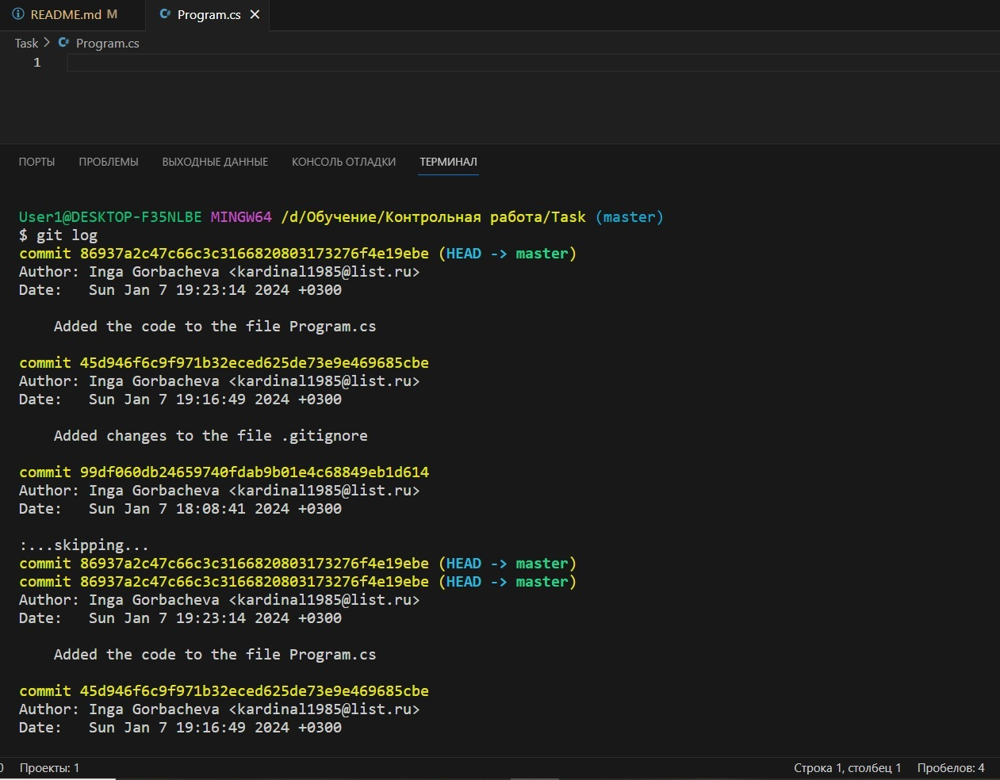

# Итоговая проверочная работа (1 блок)
## **Условия задачи**

Задача алгоритмически не самая сложная, однако для полноценного выполнения проверочной работы необходимо:

1. Создать репозиторий на __GitHub__
2. Нарисовать блок-схему алгоритма _(можно обойтись блок-схемой основной содержательной части, если вы выделяете её в отдельный метод)_
3. Снабдить репозиторий оформленным текстовым описанием решения _(файл __README.md__)_
4. Написать программу, решающую поставленную задачу
5. Использовать контроль версий в работе над этим небольшим проектом _(не должно быть так, что всё залито одним коммитом, как минимум этапы 2, 3, и 4 должны быть расположены в разных коммитах)_

**Задача:**

Написать программу, которая из имеющегося массива строк формирует новый массив из строк, длина которых меньше, либо равна 3 символам. Первоначальный массив можно ввести с клавиатуры, либо задать на старте выполнения алгоритма. При решении не рекомендуется пользоваться коллекциями, лучше обойтись исключительно массивами.

**Примеры:**
```
[“Hello”, “2”, “world”, “:-)”] → [“2”, “:-)”]
[“1234”, “1567”, “-2”, “computer science”] → [“-2”]
[“Russia”, “Denmark”, “Kazan”] → []
```
***

## **Решение**
1. Создаем репозиторий `control_work`.
2. Блок-схема алгоритма:

> 

3. Фаил `README.md`
4. Программа находится в ветке [`master`](/Task/Program.cs "Открыть решение")

Код программы:

Данный код выполняет следующие действия:
1.	Сначала он предлагает ввод в консоль "Введите элементы массива через пробел: ".
2.	Затем считывает строку, введённую пользователем, через Console.ReadLine() и сохраняет её в переменной input.
3.	Эта строка разбивается на массив строк initialArray с использованием метода Split, где в качестве разделителя используется пробел. В результате получается массив отдельных "слов" или элементов, которые были введены через пробел.
4.	Затем вызывается функция FilterShortStrings, в которую передаётся массив initialArray. Эта функция создаёт новый массив, где будут храниться только те строки, длина которых меньше или равна трем символам.
5.	Внутри функции FilterShortStrings:
Инициализируется счётчик count, который отслеживает количество коротких строк. Далее создаётся новый массив shortStringsArray того же размера, что и входной массив. С помощью цикла for массив array перебирается, и строки, длина которых менее или равна трём символам, добавляются в массив shortStringsArray.


```
Console.Write("Введите элементы массива через пробел: ");
string input = Console.ReadLine();
string[] initialArray = input.Split(' ');

string[] shortStringsArray = FilterShortStrings(initialArray);

if (shortStringsArray.Length == 0)
{
    Console.WriteLine("Нет элементов с длиной 3 символа или меньше.");
}
else
{
    PrintArray(shortStringsArray);
}

static string[] FilterShortStrings(string[] array)
{
    int count = 0;
    string[] shortStringsArray = new string[array.Length];

    for (int i = 0; i < array.Length; i++)
    {
        if (array[i].Length <= 3)
        {
            shortStringsArray[count] = array[i];
            count++;
        }
    }

    Array.Resize(ref shortStringsArray, count); 
    return shortStringsArray;
}

static void PrintArray(string[] array)
{
    for (int i = 0; i < array.Length; i++)
    {
        Console.Write($"{array[i]} ");
    }
    Console.WriteLine();
}

```
Результат вывода в терминал:

> 

5. Скриншот коммитов для подтверждения.

>